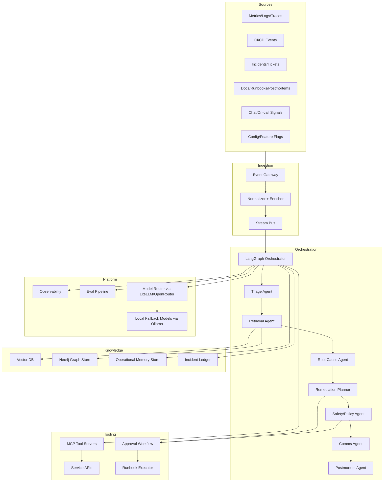
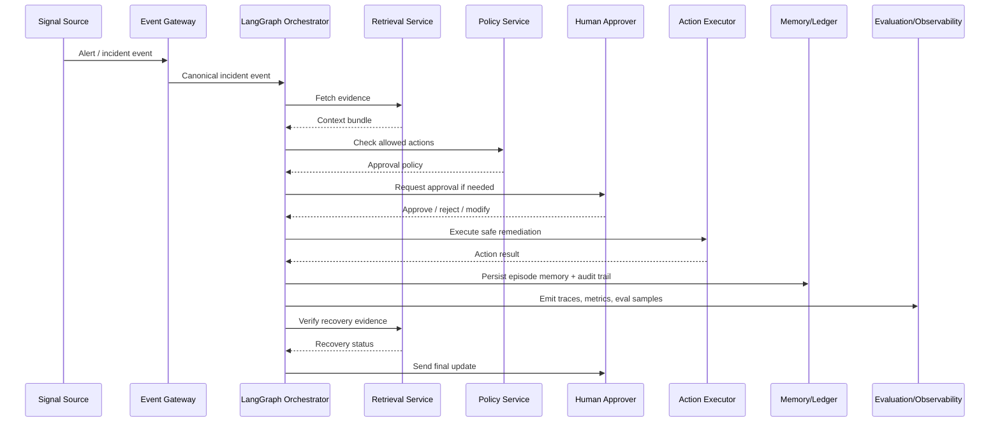
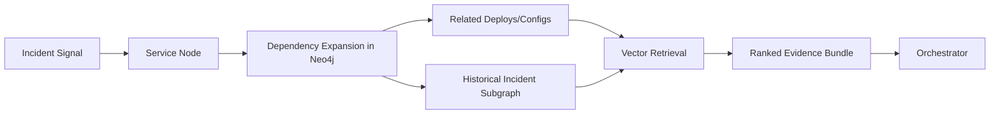
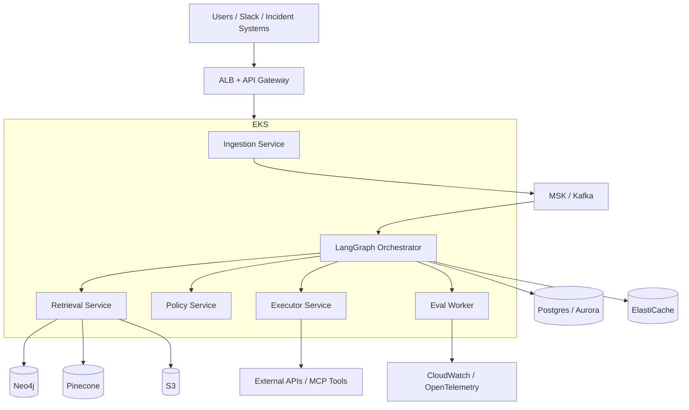

## Flagship project: **Aegis — Autonomous AI Reliability Control Plane**

Aegis is an internal-grade platform that sits on top of production telemetry, incident systems, runbooks, knowledge graphs, and ticketing tools to **triage incidents, coordinate specialized agents, recommend or execute safe remediations, and generate postmortems**.

It is not an AI model demo. It is an **AI operations system**.

It would feel believable at Google, Meta, OpenAI, Anthropic, or a serious AI infrastructure startup because it combines:

* event-driven architecture
* multi-agent orchestration
* human approval gates
* retrieval + GraphRAG
* memory systems
* model routing and fallback
* evals and red teaming
* observability and auditability
* production safety controls
* distributed workflow recovery

The real product pitch is:

> “When something breaks, Aegis turns raw signals into an actionable, audited incident workflow with humans still in control.”

---

# 1) What the system does

Aegis ingests:

* alerts from Prometheus, CloudWatch, Datadog, Grafana
* logs, traces, metrics
* deployment events from CI/CD
* incident tickets from Jira/Linear/ServiceNow
* runbooks and past postmortems
* service dependency graphs
* on-call chat context from Slack/Teams
* config changes and feature flag changes

Then it runs a multi-step workflow:

1. detect and classify incident signals
2. correlate symptoms across services
3. retrieve relevant runbooks, prior incidents, and topology
4. build a live incident graph
5. propose likely root causes
6. recommend safe remediations
7. execute approved actions through tools
8. verify recovery through telemetry
9. generate a postmortem draft and learnings
10. store long-term memory for future incidents

This gives you a project that demonstrates AI systems engineering, orchestration, reliability, and platform thinking.

---

# 2) Why this is elite-level

This is technically impressive because it is hard in all the right ways:

* it has real distributed systems concerns
* it needs safety boundaries around autonomous action
* it has stateful long-running workflows
* it has hybrid retrieval across vector + graph + structured data
* it must support model routing and fallbacks
* it must be observable and debuggable
* it must be evaluated continuously
* it must handle partial failure and recovery
* it must integrate with real production systems
* it has both human-in-the-loop and machine-in-the-loop paths

That is exactly the kind of thing that signals “this person can build AI infrastructure, not just prompt apps.”

---

# 3) High-level architecture



---

# 4) Core service boundaries

## A. Event Gateway

Receives alerts, logs, webhooks, incident signals, deployment events.

Responsibilities:

* auth
* rate limiting
* schema validation
* idempotency keys
* tenant separation
* event signing
* routing to stream bus

## B. Normalizer + Enricher

Turns raw events into canonical incident facts:

* service name
* environment
* severity
* symptom class
* time window
* affected dependencies
* recent deploys
* correlated traces/logs

## C. Stream Bus

Carries events between services.

Use:

* Kafka / MSK for high-throughput event streams
* SQS for workflow tasks and retries
* EventBridge for event routing across AWS services

## D. LangGraph Orchestrator

The workflow brain. It manages:

* branching logic
* retries
* state checkpoints
* approval gates
* long-running workflows
* compensation steps
* resume after failure

## E. Retrieval Service

Hybrid retrieval:

* vector similarity
* keyword search
* graph traversal
* incident similarity
* temporal filtering
* structured metadata filtering

## F. Knowledge Graph Service

Stores:

* service dependencies
* incident causal chains
* runbook links
* owner/on-call info
* SLO relationships
* deployments and changes
* historical recurrence patterns

## G. Memory Service

Stores workflow memory at multiple time scales:

* episode memory for an active incident
* case memory for a team/service
* organization memory for repeated failure modes
* policy memory for safe actions

## H. Safety/Policy Service

Decides:

* what the agent may do
* when human approval is required
* what actions are forbidden
* whether confidence is high enough
* whether the system should degrade to read-only mode

## I. Evaluation Service

Runs:

* offline tests
* replay tests
* hallucination checks
* routing quality tests
* retrieval quality tests
* remediation correctness tests
* agent regression tests

## J. Observability Service

Tracks:

* workflow latency
* tool failures
* model costs
* token usage
* retrieval hit rate
* agent success rate
* human override rate
* incident resolution time

---

# 5) Multi-agent orchestration design

Use **LangGraph** as the workflow state machine.

## Agent roles

### 1. Triage Agent

Goal: classify the incoming situation.

Inputs:

* alert payload
* recent deploys
* service context
* historical incident patterns

Output:

* severity estimate
* candidate service
* incident type
* next action

### 2. Retrieval Agent

Goal: gather evidence.

Tools:

* vector store
* Neo4j
* ticketing APIs
* runbook index
* log query tools
* trace query tools

Output:

* evidence bundle
* ranked likely causes
* linked prior incidents

### 3. Root Cause Agent

Goal: infer causal structure.

It does not “guess” a final cause too early. It builds competing hypotheses:

* bad deploy
* dependency outage
* config drift
* capacity exhaustion
* cache poisoning
* model routing failure
* queue backlog
* auth token expiry

### 4. Remediation Planner

Goal: propose the safest action sequence.

Examples:

* rollback a deployment
* scale a service
* clear a queue
* rotate credentials
* switch model route
* disable a feature flag
* shed load
* reindex knowledge store
* restart a failed worker group

### 5. Safety/Policy Agent

Goal: approve or block actions.

Checks:

* blast radius
* confidence threshold
* action policy
* environment type
* tenant sensitivity
* whether a human must approve

### 6. Communications Agent

Goal: write incident updates.

Produces:

* Slack updates
* ticket updates
* executive summaries
* customer-safe status updates

### 7. Postmortem Agent

Goal: generate a structured postmortem draft.

Includes:

* timeline
* root cause
* contributing factors
* detection gap
* remediation
* prevention actions
* follow-ups

---

# 6) Orchestration flow



---

# 7) RAG + GraphRAG architecture

Aegis should use **both vector retrieval and graph retrieval** because incident response is not just semantic similarity. It is topology, causality, and history.

## Vector layer

Stores:

* runbooks
* postmortems
* incident summaries
* engineering docs
* known error patterns
* ticket conversations

Use:

* Pinecone in managed prod
* ChromaDB locally and in dev
* embeddings from a routed model provider

## Graph layer

Stores:

* service dependency graph
* ownership graph
* incident causality graph
* deploy graph
* feature flag graph
* alert correlation graph

Use Neo4j for:

* incident-to-service traversal
* service-to-dependency expansion
* “what changed recently?”
* “what else breaks if this service is down?”
* “what runbooks apply to this topology?”

## GraphRAG strategy

When an incident occurs:

1. start from the affected service
2. expand 1–3 hops through dependency graph
3. pull recent deploy/config changes
4. identify correlated prior incidents in the same subgraph
5. retrieve the top-k relevant documents
6. rank evidence by recency, topology proximity, and failure similarity

That gives you better retrieval than pure semantic search.



---

# 8) Memory architecture

Aegis needs memory at several layers.

## A. Ephemeral working memory

Lives only during the active workflow:

* current hypothesis set
* evidence already checked
* actions already attempted
* approval state

Stored in:

* Redis or workflow state store

## B. Episode memory

One incident, one record.

Contains:

* timeline
* decisions
* tool outputs
* human decisions
* action results
* telemetry snapshots

Stored in:

* Postgres / S3-backed archive
* incident ledger

## C. Service memory

For each service:

* recurring failure modes
* preferred remediation patterns
* owner notes
* known safe actions
* system quirks

Stored in:

* vector + graph + structured store

## D. Organizational memory

Cross-service patterns:

* repeated dependency failures
* recurring deployment regressions
* systematic alert noise
* common config drift modes

Used for:

* prevention
* policy tuning
* alert quality improvement

## E. Policy memory

What actions are usually safe for which services/environments.

Examples:

* “scale consumer workers automatically in staging, require approval in prod”
* “rollback only if canary error budget breached”
* “restart a stateless worker automatically, not a stateful store”

---

# 9) Retrieval architecture

Use a **three-stage retrieval pipeline**.

## Stage 1: Structured filtering

Filter by:

* service
* environment
* severity
* time window
* owner team
* incident class

## Stage 2: Graph expansion

Traverse:

* service dependencies
* recent deploys
* correlated alert clusters
* upstream/downstream impacts
* known ownership and runbook links

## Stage 3: Hybrid ranking

Score using:

* embedding similarity
* graph proximity
* recency
* success of prior remediation
* similarity of failure signatures
* incident severity overlap

### Retrieval outputs

* top incident analogs
* applicable runbooks
* dependency chain
* recent changes
* likely remediation candidates
* “do not do” safety warnings

---

# 10) Context engineering strategy

This is a major differentiator.

Aegis should never dump everything into context. It should build **tiered context packs**.

## Context pack tiers

### Tier 0: Minimal live state

* incident id
* service
* severity
* timestamps
* current workflow step

### Tier 1: Triage context

* recent alerts
* deploys
* top symptoms
* owner metadata

### Tier 2: Evidence context

* logs, traces, metrics snapshots
* retrieved docs
* graph neighbors
* prior incidents

### Tier 3: Decision context

* policy constraints
* blast radius
* approval requirements
* candidate actions

### Tier 4: Action context

* one action at a time
* exact tool inputs
* rollback criteria
* verification query

## Principles

* retrieve narrowly, not greedily
* summarize before expanding
* prefer structured facts over raw text
* keep a provenance trail for every fact
* attach confidence to every assertion
* never let the model “freewheel” over the whole incident archive

That is the kind of thing strong interviewers want to hear.

---

# 11) Infrastructure architecture

Use a microservice-oriented setup, but not microservice sprawl.

## Suggested stack

* **AWS**
* **Docker**
* **Kubernetes (EKS)**
* **Kafka / MSK**
* **SQS**
* **Postgres**
* **Redis**
* **Neo4j**
* **Pinecone** or **ChromaDB**
* **S3**
* **OpenTelemetry**
* **Prometheus / Grafana**
* **Loki / OpenSearch**
* **GitHub Actions**
* **Terraform / CDK**
* **LiteLLM**
* **OpenRouter**
* **Ollama** for fallback/local models
* **MCP servers** for tool integration

## Service layout

* api-gateway
* event-ingestor
* workflow-orchestrator
* retrieval-service
* graph-service
* memory-service
* policy-service
* action-executor
* eval-service
* observability-service
* admin-console backend

---

# 12) AWS architecture



## AWS design decisions

* EKS for orchestration and service isolation
* MSK for high-throughput event streams
* SQS for task retries and dead-letter queues
* Aurora Postgres for transactional state
* Redis for workflow cache and locks
* S3 for artifacts, traces, incident snapshots, and eval datasets
* Secrets Manager for credentials
* IAM least privilege per service account
* WAF + API Gateway auth at the edge

---

# 13) Deployment architecture

## Environments

* local dev
* sandbox
* staging
* production

## Deployment pattern

* trunk-based development
* canary releases
* feature flags
* shadow evaluation in staging
* blue/green for workflow engine upgrades

## Runtime model

* stateless API services
* stateful stores externalized
* workflow checkpoints persisted
* agent steps idempotent
* executor isolated from planner

## Safe release strategy

1. deploy new retrieval or agent logic to shadow mode
2. compare outputs against baseline
3. run offline replay evaluation
4. enable on a small subset of incidents
5. gradually ramp traffic

---

# 14) Security considerations

This is critical for credibility.

## Controls

* OIDC/SAML SSO
* RBAC by team, environment, and service
* least-privilege IAM roles
* signed webhooks
* secrets in Secrets Manager
* encrypt data at rest and in transit
* per-tenant data isolation if multi-tenant
* audit logs for every tool call
* approval gates for prod actions
* action allowlists
* command parameter validation
* rate limiting and abuse detection

## LLM-specific security

* prompt injection detection for retrieved docs
* tool sandboxing
* output sanitization
* restricted tool schemas
* no raw shell access from models
* provenance tags on retrieved context
* deny-by-default executor
* red-team tests against malicious runbooks and poisoned alerts

---

# 15) Monitoring and observability stack

You should instrument the platform like a real production system.

## Metrics

* incident workflow latency
* time to first hypothesis
* time to first action
* approval wait time
* success rate per action type
* rollback rate
* false positive retrieval rate
* model cost per incident
* token usage per agent
* tool error rate
* human override rate
* auto-remediation success rate

## Tracing

Use OpenTelemetry for:

* each workflow step
* each retrieval query
* each model call
* each tool call
* each retry
* each approval decision

## Logging

* structured JSON logs
* correlation ids
* incident ids
* tenant ids
* service ids
* action ids

## Dashboards

Not generic dashboards, but operational ones:

* incident resolution funnel
* agent failure heatmap
* retrieval precision/recall over time
* tool execution failure modes
* confidence vs. outcome curves
* cost-to-resolve breakdown

---

# 16) AI evaluation strategy

You need a serious eval system or the project will not feel production-grade.

## Offline evals

Build a dataset of:

* historical incidents
* synthetic incident replays
* adversarial prompt injections
* bad runbooks
* noisy alerts
* dependency outages

Measure:

* root cause ranking quality
* retrieval precision
* remediation correctness
* hallucination rate
* policy violation rate
* alert classification accuracy
* human approval acceptance rate

## Workflow evals

Evaluate:

* whether the right branch was taken
* whether the right evidence was gathered
* whether the right escalation was triggered
* whether a safe fallback happened after failure

## Safety evals

* forbidden actions never executed
* no action without required approval
* no tool call outside schema
* no unverified claim presented as fact

## Regression evals

Run on every PR:

* golden incident replay
* retrieval benchmark
* action safety benchmark
* prompt injection benchmark

## Red teaming

Try to break it with:

* malicious docs
* misleading telemetry
* injected chat instructions
* fake incident events
* conflicting signals

---

# 17) Failure handling and retries

This is where the project gets serious.

## Failure modes

* LLM timeout
* retrieval timeout
* stale graph data
* executor tool failure
* approval timeout
* duplicate events
* partial remediation success
* conflicting signals
* service outage in a dependency
* model provider outage
* bad context packing
* poisoning from bad docs

## Mitigations

* idempotency keys on every action
* checkpoints per graph node
* dead-letter queues
* circuit breakers
* exponential backoff with jitter
* fallback to smaller local models
* fallback from auto-action to recommend-only
* fallback from vector to graph retrieval
* optimistic concurrency control in workflow state
* compensating rollback actions
* replayable event logs
* duplicate suppression

## Example recovery behavior

If the planner times out:

* persist state
* emit retry event
* resume from last checkpoint
* reuse previous retrieval bundle
* avoid duplicate tool calls

---

# 18) Scaling strategy

## Bottlenecks

1. model call latency
2. retrieval fanout
3. graph traversal cost
4. event spikes during outages
5. tool rate limits
6. workflow state contention
7. vector query throughput
8. incident replay throughput

## Scaling approaches

* asynchronous workflow execution
* partitioning by tenant/service
* cache recent incident contexts
* precompute service neighborhoods
* prebuild graph snapshots
* batch retrieval for similar alerts
* separate hot path from cold path
* queue-based backpressure
* rate-limit external tool access
* autoscale workers based on queue depth

## Hot path vs cold path

Hot path:

* incident triage
* top evidence retrieval
* safe remediation recommendation

Cold path:

* postmortem generation
* trend analysis
* long-term memory updates
* eval replays

---

# 19) Cost optimization strategy

This is important for production realism.

## Cost controls

* route trivial tasks to cheaper models
* use local Ollama models for classification or summarization fallback
* cache retrieval results
* compress context aggressively
* avoid repeated graph traversals
* only call large models after smaller gating models pass
* batch embedding jobs
* store long-term artifacts in S3
* use streaming summaries rather than full transcript replay
* record-and-replay for repeated incident types

## Routing strategy with LiteLLM/OpenRouter

* cheap model for triage
* mid-tier model for retrieval synthesis
* strong model for final remediation reasoning
* local model when provider unavailable
* policy layer decides which model class is allowed for each step

---

# 20) CI/CD strategy

## Pipeline stages

1. lint and type check
2. unit tests
3. integration tests
4. workflow simulation tests
5. replay evals
6. retrieval benchmark tests
7. safety tests
8. container image build
9. deploy to staging
10. shadow traffic evaluation
11. progressive rollout

## Critical CI additions

* snapshot tests for prompts
* workflow graph schema validation
* tool contract tests
* mock model router tests
* synthetic incident replay suite
* policy rule tests

## Branch protection

No merge unless:

* eval gate passes
* safety gate passes
* migration checks pass
* observability checks pass

---

# 21) GitHub monorepo structure

```text
aegis/
  apps/
    api-gateway/
    incident-console/
    admin-console/
  services/
    ingest-service/
    orchestrator-service/
    retrieval-service/
    graph-service/
    memory-service/
    policy-service/
    executor-service/
    eval-service/
    observability-service/
  agents/
    triage-agent/
    retrieval-agent/
    root-cause-agent/
    remediation-agent/
    policy-agent/
    comms-agent/
    postmortem-agent/
  tools/
    mcp-servers/
    integrations/
    model-router/
  packages/
    shared-events/
    shared-auth/
    shared-telemetry/
    shared-schemas/
    prompt-library/
    workflow-runtime/
  infra/
    terraform/
    helm/
    k8s/
    docker/
  evals/
    datasets/
    replays/
    redteam/
    golden/
  docs/
    architecture/
    runbooks/
    ADRs/
    postmortems/
```

This structure signals real platform thinking.

---

# 22) API design

## Public APIs

### `POST /incidents/ingest`

Ingests alerts, tickets, or incident signals.

### `POST /incidents/{id}/triage`

Starts or resumes orchestration.

### `GET /incidents/{id}`

Returns incident state, evidence, actions, and timeline.

### `POST /incidents/{id}/approve`

Human approval endpoint for proposed actions.

### `POST /incidents/{id}/actions`

Submits safe remediation commands.

### `GET /services/{service}/memory`

Returns service-specific learned context.

### `GET /graph/query`

Graph traversal and topology lookup.

### `POST /evals/replay`

Replays historical incidents through current workflows.

### `POST /evals/redteam`

Runs adversarial tests against prompts, retrieval, and tools.

## API principles

* versioned schemas
* idempotent writes
* correlation IDs
* signed requests
* audit trails
* strict auth scopes

---

# 23) Queue/event architecture

Use a hybrid design.

## Event bus

For high-volume signals:

* alert_created
* deploy_finished
* trace_anomaly_detected
* incident_correlated
* remediation_started
* remediation_completed
* incident_closed

## Task queue

For workflow steps:

* retrieve_context
* rank_hypotheses
* check_policy
* request_approval
* execute_action
* verify_recovery
* write_postmortem

## Dead-letter queue

For failed tasks needing manual review.

## Event schema

Every event should include:

* event id
* incident id
* service id
* timestamp
* source
* schema version
* correlation id
* tenant id
* signature
* idempotency key

---

# 24) Failure scenarios and mitigation strategies

## Scenario 1: Alert storm

A cascading outage causes thousands of alerts.

Mitigation:

* deduplicate by topology
* compress incident clusters
* prioritize blast radius
* throttle model calls
* switch to summary mode

## Scenario 2: Poisoned runbook

A malicious or incorrect doc tells the model to do something unsafe.

Mitigation:

* document trust scoring
* policy checks before tool execution
* prompt injection filtering
* allowlisted actions only
* provenance display to humans

## Scenario 3: Model provider outage

Primary hosted model is unavailable.

Mitigation:

* LiteLLM routing fallback
* local Ollama model
* degraded read-only mode
* cached incident templates

## Scenario 4: Partial remediation failure

Scale-up succeeds but error rate remains high.

Mitigation:

* verify recovery before closing incident
* multi-step rollback/rollback+revert plan
* automate follow-up investigation

## Scenario 5: Wrong service inferred

The system routes to the wrong dependency chain.

Mitigation:

* cross-check with graph and metrics
* confidence thresholds
* human confirmation
* service alias resolution

---

# 25) Recruiter signal

Recruiters and hiring managers would care because this project demonstrates:

* ownership across backend, platform, and AI layers
* serious engineering depth, not toy prompt apps
* experience with workflows, reliability, and distributed systems
* ability to integrate models safely into production systems
* understanding of observability, evals, and debugging
* taste for infra and operational realism
* ability to design for human approval and failure recovery
* comfort with model routing and hybrid architectures

It reads like someone who can work on:

* AI platform teams
* developer productivity infra
* reliability engineering
* agent orchestration systems
* internal AI tooling
* production ML/AI systems

---

# 26) Resume bullet points

Here are strong bullets:

* Built Aegis, an autonomous AI reliability control plane that triages production incidents, retrieves topology-aware context, proposes remediations, and generates postmortems across distributed services.
* Designed a LangGraph-based orchestration engine with checkpointed long-running workflows, human approval gates, idempotent retries, and safe rollback semantics.
* Implemented hybrid GraphRAG retrieval across Neo4j service graphs, vector search, and incident memory stores to improve root-cause ranking and remediation relevance.
* Developed a multi-agent architecture with specialized triage, retrieval, policy, remediation, communications, and postmortem agents routed through model fallbacks using LiteLLM/OpenRouter and local Ollama models.
* Built production-grade observability, evaluation, and red-team pipelines measuring workflow success rate, hallucination rate, tool failure rate, and human override rate.
* Deployed the platform on AWS with EKS, MSK, Aurora, Redis, S3, and OpenTelemetry, with canary rollouts, audit logging, and least-privilege execution controls.
* Reduced incident handling latency by automating evidence gathering, hypothesis ranking, and safe remediation recommendations with full human-in-the-loop guardrails.

---

# 27) LinkedIn project description

**Aegis — Autonomous AI Reliability Control Plane**

Built a production-style AI operations platform for incident triage, root-cause analysis, remediation planning, and postmortem generation across distributed systems. The platform combines LangGraph orchestration, GraphRAG over Neo4j, vector retrieval, model routing via LiteLLM/OpenRouter, local fallback models, human approval gates, and full observability/evaluation pipelines. Designed for reliability, auditability, and safe execution in production environments with event-driven workflows, idempotent retries, and rollback-aware action execution.

---

# 28) Interview demo strategy

The demo should look like a real incident, not a slide deck.

## Demo flow

1. trigger a synthetic outage event
2. show ingestion and clustering of correlated alerts
3. display the dependency graph and recent deploys
4. show retrieval of prior incidents and runbooks
5. let the orchestrator produce competing hypotheses
6. show an approval request for a safe remediation
7. execute a safe action
8. verify recovery from telemetry
9. generate a postmortem draft
10. show eval trace and audit log

## The best live demo artifact

A replayable incident simulator that can:

* inject failures
* emit signals
* stress the workflow
* show decision traces
* compare baseline vs. improved runs

That demo sells architecture maturity instantly.

---

# 29) Step-by-step implementation roadmap

## Phase 1: Core platform skeleton

* event ingestion
* incident schema
* workflow engine
* basic UI/API
* audit logging
* observability baseline

## Phase 2: Retrieval and memory

* vector store
* Neo4j graph model
* incident memory store
* document ingestion
* prior incident retrieval

## Phase 3: Multi-agent orchestration

* triage agent
* retrieval agent
* policy agent
* remediation planner
* human approval flow

## Phase 4: Safe execution

* runbook executor
* idempotent tool calls
* rollback support
* dead-letter queues
* action verification

## Phase 5: Evaluation layer

* golden incident set
* replay tests
* safety tests
* red-team tests
* regression gating in CI

## Phase 6: Production hardening

* rate limiting
* tenant isolation
* multi-region readiness
* disaster recovery
* cost optimization
* caching
* model routing

---

# 30) MVP breakdown

## MVP goal

A system that can handle one class of incidents end-to-end.

### MVP scope

* ingest alerts
* cluster them into an incident
* retrieve relevant runbooks and past incidents
* propose one of three remediation options
* ask for human approval
* execute one safe action
* verify recovery
* draft the postmortem

### MVP constraints

* one or two services only
* one environment only
* one model provider + one fallback
* limited tool surface
* manual approval always required

This is enough to show architecture depth without exploding scope.

---

# 31) Staff-engineer-level extensions

These are the upgrades that make it exceptional.

## A. Policy-as-code remediation engine

Encode org safety policy in code and use it to gate actions.

## B. Self-healing incident workflows

If a workflow fails, it resumes from the last checkpoint automatically.

## C. Cross-incident learning

Build a recurrence model that suggests preventive actions based on historical patterns.

## D. Topology-aware blast radius prediction

Estimate downstream impact before any action is taken.

## E. Model routing optimization

Use a learned router to select the cheapest model that can safely complete the step.

## F. Continuous red teaming

Generate adversarial incidents and malicious docs automatically.

## G. Multi-region failover

If the primary control plane fails, a secondary region can still ingest, triage, and notify.

## H. Agent simulation environment

Replay incidents in a sandbox to test agent behavior before production use.

## I. Human trust scoring

Track how often humans accept or override suggestions to adapt confidence thresholds.

## J. Autonomous prevention loop

Turn recurring incidents into infra improvement tickets automatically.

---

# 32) Five additional elite-level backup ideas

Ranked by hiring impact.

## 1. **AI Developer Operations Platform**

**Why it ranks high:** Every AI company cares about developer productivity, evals, and internal AI operations.
**Difficulty:** Very high
**Timeline:** 10–16 weeks
**Best skills shown:** CI/CD, evals, model routing, workflow orchestration, internal tooling, observability
**What it is:** An internal platform that automates code review summaries, test flake diagnosis, build failure triage, and release risk analysis across repos using agents, event streams, and policy gates.

## 2. **Enterprise Agent Execution Fabric**

**Why it ranks high:** This is foundational infra for agentic systems.
**Difficulty:** Very high
**Timeline:** 12–20 weeks
**Best skills shown:** distributed systems, queue design, orchestration, MCP, tool safety, human approval workflows
**What it is:** A multi-tenant runtime that executes long-running agents with memory, tool access, retries, and observability.

## 3. **Self-Healing Data Platform Ops Layer**

**Why it ranks high:** Strong systems + data engineering signal.
**Difficulty:** High
**Timeline:** 8–14 weeks
**Best skills shown:** streaming, event-driven systems, recovery logic, lineage, observability
**What it is:** Detects broken pipelines, explains failures, correlates upstream/downstream impact, and auto-repairs safe pipeline issues.

## 4. **Enterprise Knowledge Operating System**

**Why it ranks high:** Shows GraphRAG done correctly, but not as a toy app.
**Difficulty:** High
**Timeline:** 8–12 weeks
**Best skills shown:** GraphRAG, memory systems, retrieval, graph modeling, access control
**What it is:** A topology-aware knowledge layer for company docs, systems, and ownership graphs with action-oriented workflows.

## 5. **AI Change Risk and Release Intelligence Platform**

**Why it ranks high:** Real production pain, strong infra story.
**Difficulty:** Medium-high
**Timeline:** 6–10 weeks
**Best skills shown:** deployment systems, risk scoring, event processing, observability, incident prevention
**What it is:** Predicts risky deploys, correlates change with incidents, and blocks unsafe releases or routes them to extra review.

---

# 33) Quick difficulty / timeline summary

| Idea                                             | Hiring Impact |  Difficulty |  Build Time |
| ------------------------------------------------ | ------------: | ----------: | ----------: |
| Aegis: Autonomous AI Reliability Control Plane   |     Very high |   Very high | 12–20 weeks |
| AI Developer Operations Platform                 |     Very high |   Very high | 10–16 weeks |
| Enterprise Agent Execution Fabric                |     Very high |   Very high | 12–20 weeks |
| Self-Healing Data Platform Ops Layer             |          High |        High |  8–14 weeks |
| Enterprise Knowledge Operating System            |          High |        High |  8–12 weeks |
| AI Change Risk and Release Intelligence Platform |          High | Medium-high |  6–10 weeks |

---

# 34) The best choice

If the goal is to look like a strong candidate for AI infrastructure, platform, or systems roles, **Aegis** is the best flagship project.

Why:

* it has clear user value
* it is deeply systems-heavy
* it uses multiple agents without feeling gimmicky
* it demonstrates reliability engineering
* it naturally forces you to design for evaluation, safety, and observability
* it lets you show architecture tradeoffs at every layer

---

# 35) One-sentence positioning

**Aegis is an autonomous, policy-governed AI operations control plane for incident response, built with multi-agent orchestration, GraphRAG, workflow recovery, and production-grade observability.**

If you want, I can turn this into a **complete build spec** next: repo layout, exact services, API contracts, database schemas, and a 12-week implementation plan with milestones.
